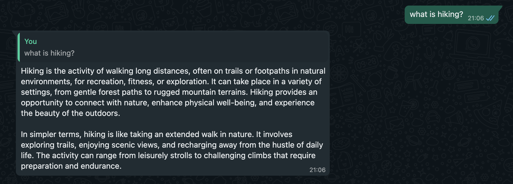
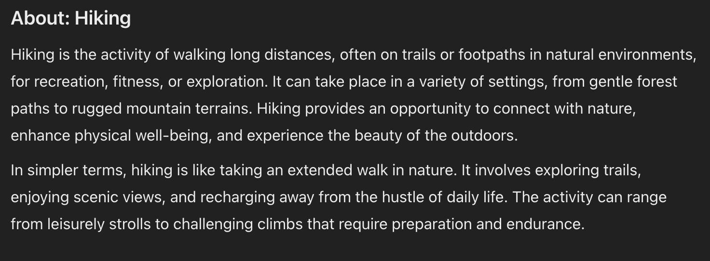
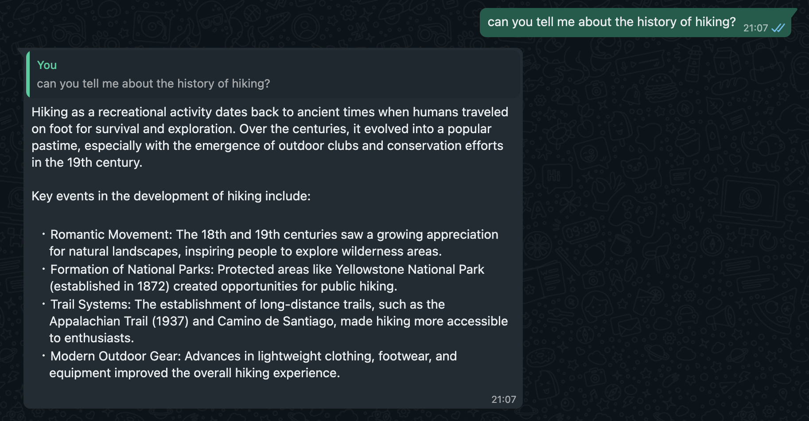
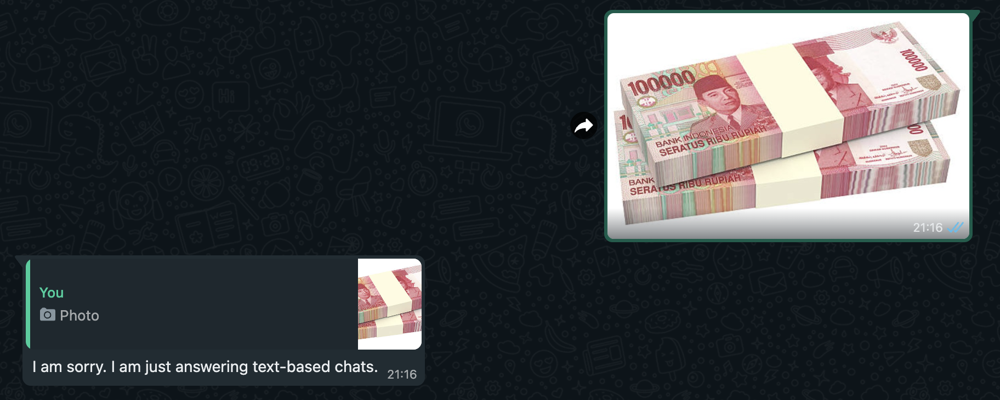
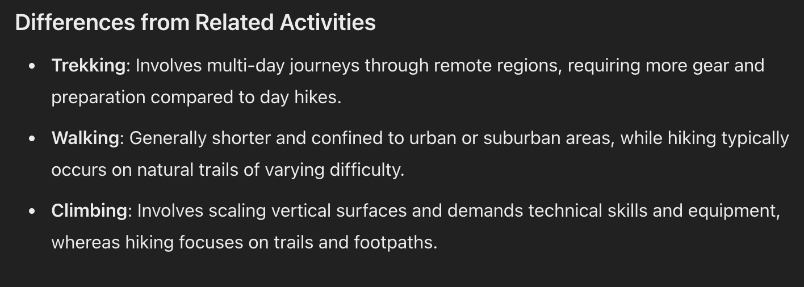

# WhatsApp AI Chatbot

This project is a WhatsApp chatbot powered by Google Generative AI, designed to handle text-based queries and provide intelligent responses. It integrates WhatsApp Web for message processing and uses AI capabilities to deliver contextual and meaningful replies.

## Features

- Generative AI Responses: Leverages Google Generative AI to provide text-based responses.
- WhatsApp Integration: Seamlessly integrates with WhatsApp Web for message handling.
- Media Handling: Detects media messages and provides basic metadata.
- Dynamic Expertise: Initializes with predefined expertise data for better contextual answers.
- QR Code Authentication: Allows users to authenticate the WhatsApp session with a QR code.

## Prerequisites

Ensure you have the following installed:

1. Node.js (version 14 or higher)
2. WhatsApp account for testing.

## Installation

1. Clone the Repository

    `git clone https://github.com/yourusername/whatsapp-ai-chatbot.git`
    `cd whatsapp-ai-chatbot`

2. Install Dependencies

    `npm install`

3. Set Environment Variables

    Create a .env file in the root directory and add your API key for Google Generative AI:
    `API_KEY=your_google_generative_ai_api_key`

4. Add Expertise Files
    Ensure you have the following files in the `dataset/` directory:

    * `rules.txt`: Contains chatbot rules or configurations.
    * `hiking-tips-espertise.txt`: Contains expertise or domain-specific knowledge.

## Usage

1. Start the Application

    Run the chatbot with the following command:
    `node index.js`

2. Authenticate WhatsApp Web

    * Scan the QR code displayed in the terminal using the WhatsApp app on your phone.
    * Once authenticated, the chatbot will be ready to handle messages.

## Commands

- Text Queries: Send any text message to get a response from the chatbot.
- Media Info: Send `!mediainfo` along with a media file to receive metadata information about the file.
- Exit Chat: Type `exit` to close the application gracefully.

## Example

1. Positive Flow. Asking the Chatbot about Hiking.

   Example 1
   

   Dataset 1
   

2. Another Positive Flow. Asking the Chatbot about Hiking.

   Example 2
   

   Dataset 2
   

3. Negative Flow. Asking the Chatbot about Image.

   Example 3
   

   Dataset 3
   

## Notes

- The chatbot only responds to text-based messages. Media-related queries will return metadata only.
- Ensure stable internet connectivity for WhatsApp Web and Google Generative AI API to function properly.

## Troubleshooting

- QR Code Not Displayed: Ensure you have a terminal that supports ANSI escape codes.
- API Key Errors: Double-check the `API_KEY` in your `.env` file.
- Chatbot Not Responding: Verify that the expertise files are properly formatted and placed in the `dataset/` directory.

## Acknowledgments

- whatsapp-web.js for WhatsApp integration.
- Google Generative AI for powering chatbot intelligence.
- qrcode-terminal for generating QR codes.
